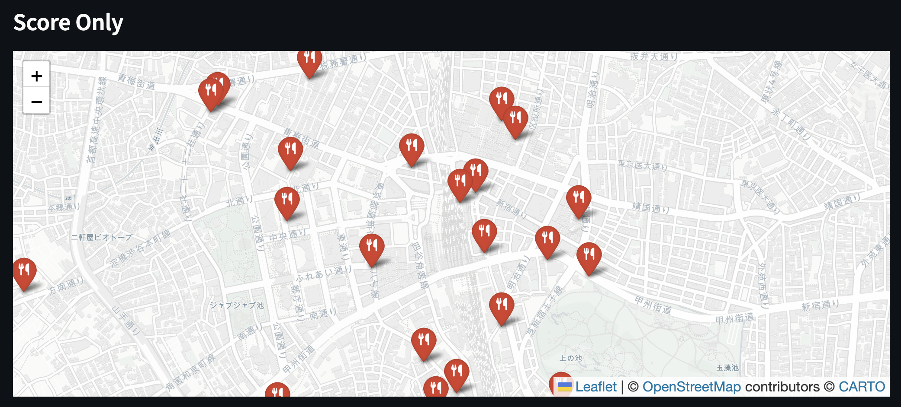
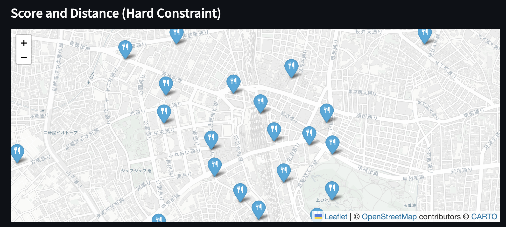
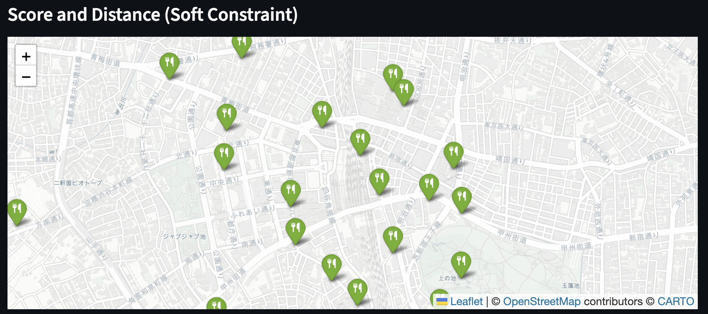

# 地図アプリのピン配置ロジックの検討

## 背景

Google Mapなどの地図アプリでは、なんらかの場所を検索した時に地図上にピンが立つ。
どのようにピンが配置されるかは、ユーザーの検索しやすさに影響する可能性がある。例えば、同じ場所にピンが集中して重なっている画面より、程よくピンがばらけている方が検索しやすい可能性がある。

## 目的

ピンの配置ロジックを検討して、どうすると良さそうか学ぶこと。

## 実験1: スコアと画面上での距離を考慮したピン配置

### 背景・目的

ここでは、検索結果に対する関連度が場所ごとにスコアとして割り当てられていることを仮定する。また、画面上に一度に配置できるピンの数に上限を設ける。
スコアが高い順にピンを配置するロジックをベースラインとして、なるべくスコアが高いかつピン同士の距離が一定離れているピン配置はどうなるか、定性的な評価と定量的な評価の両面を通して理解することを目的とする。

### 検討ロジック

1つ目のロジックは次の最適化問題で表せる。これをロジックAとする。

```math
\begin{align*}
    \text{Maximize} \quad & \sum_{s \in S} x_{s}r_{s} \\
    \text{s.t.} & \sum_{s \in S} x_{s} \le K \\
    & x_{s} \in \{0, 1\},\ \forall s \in S \\
    & x_{s} + x_{t} \le 1,\ \forall (s, t) \in P
\end{align*}
```

記号の定義は以下の通りである。

- $S$: 場所集合。要素$s$が場所を表す。
- $x_{s}$: 場所$s$を表示するなら1、表示しないなら0を取る。
- $r_{s}$: 場所$s$の関連度スコア。
- $a_{s} = (x_{s}, y_{s})$: 場所$s$の座標。
- $K$: ピンの表示数上限。
- $L$: 異なるピン同士の最小距離。

```math
\begin{align*}
    P &= \{(s, t) | s \neq t,\ d(s, t) \le R\} \subset S \times S \\
    d(s, t) &= \|a_{s} - a_{t}\|_{2} \\
\end {align*}
```

集合$P$は、距離が$R$以下の異なる2つの場所のペアからなる集合であり、最適化問題の制約は距離が$R$以下の場所のうちどちらか一方しか表示しないことを表している。

2つ目のロジックは次の最適化問題で表せる。これをロジックBとする。

```math
\begin{align*}
    \text{Maximize} \quad & \sum_{s \in S} x_{s}r_{s} - \lambda \sum_{s, t \in P} w_{s, t}x_{s}x_{t} \\
    \text{s.t.} & \sum_{s \in S} x_{s} \le K \\
    & x_{s} \in \{0, 1\},\ \forall s \in S
\end{align*}
```

新たな記号の定義は以下の通りである。

- $w_{s, t}$: 場所$s$と場所$t$のピンが同時に配置されることによる悪影響を表す数値。例えば、$1/d(s, t)$。
- $\lambda$: 重み係数。

1つ目のロジックは距離が$R$未満の2点に同時にピンを立てることを一切許容しなかったが、2つ目のロジックでは許容している点が異なる。例えば、距離が$R$未満でも非常に関連度スコアが高いなら、同時にピンが配置される。

比較対象となるベースラインはスコアが高い順に場所を選択するだけのため、次のように表される。これをロジックCとする。

```math
\begin{align*}
    \text{Maximize} \quad & \sum_{s \in S} x_{s}r_{s} \\
    \text{s.t.} & \sum_{s \in S} x_{s} \le K \\
    & x_{s} \in \{0, 1\},\ \forall s \in S
\end{align*}
```

### 実験方法

ダミーデータを生成し、定性的な評価と定量的な評価を実施した。
比較手法はロジックA、ロジックB、ロジックCの3つである。

#### 定性的な評価

Streamlitで簡単な画面を作成し、ピンの配置が実際にどう変わるかを確認した。

#### 定量的な評価

次の評価指標を用いた。

- ピン配置された場所のスコア平均値。
- ピン配置された場所のうち距離がR未満であるペアの割合。

### 結果

#### 定性的な評価

ロジックAではピンの重複が見られるが、ロジックBにすることで重複がなくなった。ロジックCの場合は重複する配置も採用されるケースがあることが確認できた。ロジックの設計に対し、妥当な結果である。
ぱっと見ロジックBがスッキリしている印象を受けるが、どこも同じくらいのピン数となるため、例えば検索対象の場所が密集しているエリアがロジックAよりわかりづらい印象を受けた。例えば、飲食店を探している時、飲食店が多いエリアに向かった方が良さそうな気がするが、ロジックBだとそういったエリアの特徴が見えづらくなっており、これが本当に検索体験として良いのか疑問が残った。
これに対して、ロジックCはロジックAとロジックBのいいとこどりをしたような見た目になっており、定性的には最も良い印象を受けた。

<div align="center">
  
  <p>図1: ロジックA</p>
</div>

<div align="center">
  
  <p>図2: ロジックB</p>
</div>

<div align="center">
  
  <p>図3: ロジックC</p>
</div>
